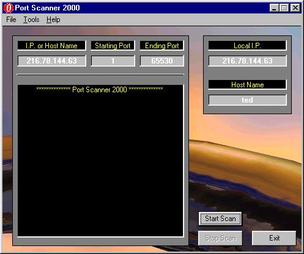



## Port Scanner 2000

### Description

More than simply scan ports on a remote computer, this code should help a beginner understand the use of the winsock control. The user is able to choose a range of ports and scan them to see if any are open. Also shows the local I.P. and computer name.
 
### More Info
 
No additional inputs.

             |
---                |---
**Submitted On**   |2000-10-06 23:29:32
**By**             |[Ted Bogaerts](https://github.com/Planet-Source-Code/PSCIndex/blob/master/ByAuthor/ted-bogaerts.md)
**Level**          |Beginner
**User Rating**    |4.8 (19 globes from 4 users)
**Compatibility**  |VB 6\.0
**Category**       |[Internet/ HTML](https://github.com/Planet-Source-Code/PSCIndex/blob/master/ByCategory/internet-html__1-34.md)
**World**          |[Visual Basic](https://github.com/Planet-Source-Code/PSCIndex/blob/master/ByWorld/visual-basic.md)
**Archive File**   |[CODE\_UPLOAD1156811102000\.zip](https://github.com/Planet-Source-Code/ted-bogaerts-port-scanner-2000__1-12700/archive/master.zip)

